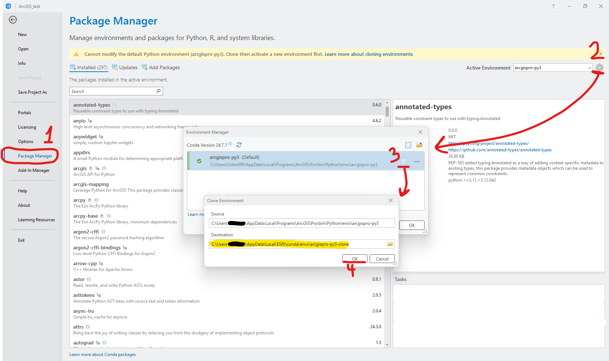

# RuralATGapFinder
A tool to analyze and visualize active transportation disparity for rural residential communities in Washington state

## Environment setup
#### if you don't have anaconda on your system (https://pro.arcgis.com/en/pro-app/latest/arcpy/get-started/what-is-conda.htm):
1. open "python command prompt" from ArcGIS folder
2. clone the default conda env of ArcGISPro
3. activate your new environment and install `geopandas` and `pygris` packages: 
```angular2html
<!-- in Python Command Prompt in ArcGIS folder -->
conda create --clone arcgispro-py3 --name my_env --pinned
conda activate my_env
conda install geopandas 
pip install pygris
```

#### If you already have conda on your system: 
1. Open Package Manager for ArcGIS Project tab
2. clone the default package and copy the path in which you are cloning your new environment. 
Activate your new environment
   
   - this may also work. not sure. `conda create --clone "C:\Users\Soheil99\AppData\Local\Programs\ArcGIS\Pro\bin\Python\envs\arcgispro-py3" --name my_env`
```angular2html
<!-- in Windows Command Prompt or python IDE (e.g. PyCharm, VS code, ...) terminal -->
conda activate "C:\Users\**USER NAME**\AppData\Local\ESRI\conda\envs\arcgispro-py3-clone"
conda install geopandas -y
pip install pygris
```




## how to use the code
- Open  a project on ArcGIS pro
- In Package Manager, make sure the new environment is activated
- add new tools in project's Catalog
- ...

### data preparation:
- SLD 
- population centers
- POI data (geojson)
- 

## some notes:
- instruction on how to organize input files so that people don't have to have a lot of inputs
- try to have everything all gpd so that you can open source your code
- read ToDo comments
- right outside criteria is really good? 
- bad geometries in parcel gdf - use repair geometries tool or make_valid or ogr2ogr?
be mindful of crs conversions in the notebook file

some CBGs after filtering steps only have water. somehow we should remove them

in filter_CBGs_by_area_and_columns function, the line `
    study_CBGs = gpd.clip(study_CBGs, studyarea_gdf)` results in a removing more water area. If we remove this line,
results will be identical with the R file